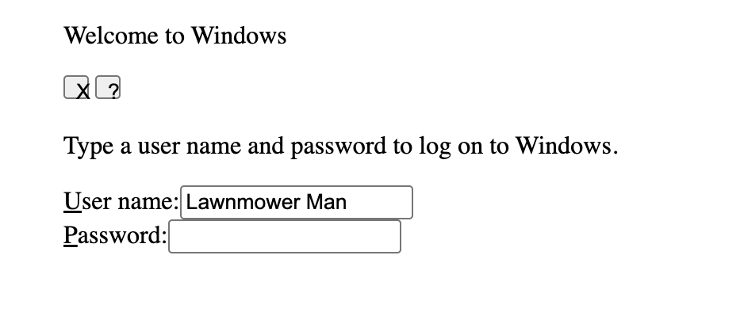
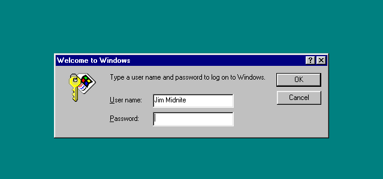
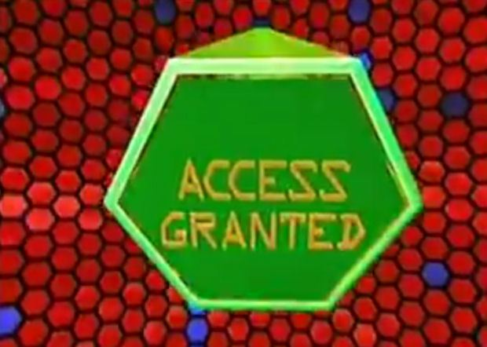
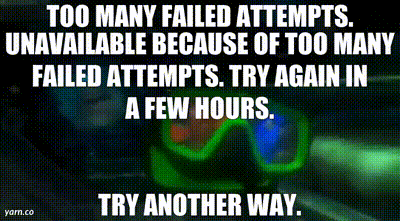

# win95password
References to Stephen King's Lawnmower Man
### Style Instructions ###
1.Before: 
1.After: 
### Script Instructions ###
1. On page load, execute a setup script to perform the following: 
1. Create two buttons inside the div with buttons id, labeled OK and Cancel (like the image "complete.png"). 
1. If the user with name "Lawnmower Man" enters "7.3942" as the password and clicks "OK", delete the entire div class box and show .
1. If the password is NOT "7.3942" with username "Lawnmower Man" and the user clicks "OK", make the background color of the body div red and clear the user name and password inputs.
1. If the user enters three bad passwords, delete the entire div class box and show .
1. If the user clicks "Cancel", clear the user name and password inputs.
